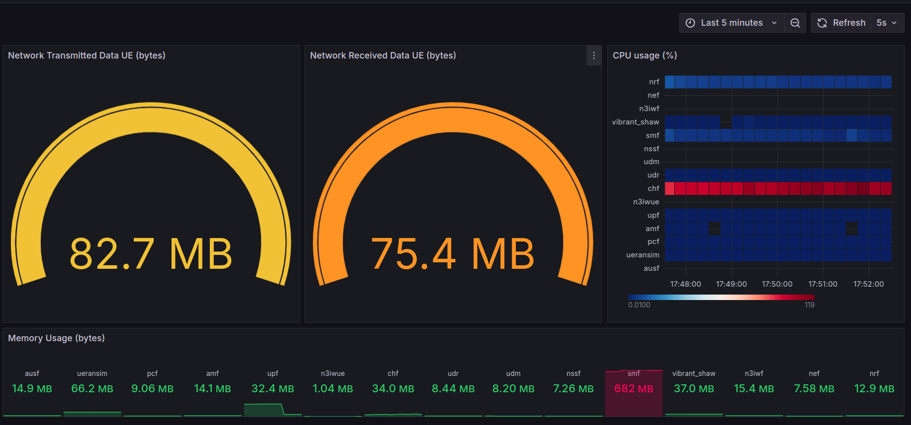

# Free5gc Analisys + Prometheus + Grafana
This repository contains the steps to deploy a 5G infraestructure in docker container and make some initial analisys with metrics generated by "docker stats" and exported for better visualization with Prometheus and Grafana.

## Step 1
Clone this repository and prerpare the exacutables with:

```
git clone https://github.com/lucianoSF/free5gc-basic-config.git
```

```
cd free5gc-basic-config
```

```
chmod +x *.sh
```


## Step 2
Deploy GTP5G kernel module with:
```
./gtp5g-deploy.sh
```


## Step 3
Deploy free5gc 5G Core with:
```
./free5gc-deploy.sh
```

## Step 4
Deploy Prometheus and Grafana with:
```
./prometheus-grafana-deplay.sh
```

## Step 5
Create a UE registry on the webui ([http://192.168.56.101:5000](http://192.168.56.101:5000) in this case) of free5gc:

default  user: <b>admin</b>\
default password: <b>free5gc</b>
<table>
  <tr>
    <td></td>
  </tr>
</table>

<table>
  <tr>
    <td></td>
  </tr>
</table>


## Step 6
a) Configure Prometheus as the Data Source of the metrics on Grafana ([http://192.168.56.101:3000](http://192.168.56.101:3000) in this case):

default  user: <b>admin</b>\
default password: <b>admin</b>
<table>
  <tr>
    <td></td>
  </tr>
</table>

<table>
  <tr>
    <td></td>
  </tr>
</table>

<table>
  <tr>
    <td></td>
  </tr>
</table>

b) Import the dashboard on grafana:
<table>
  <tr>
    <td></td>
  </tr>
</table>


## Step 6
Test the UE connection with the 5G:

a) Run the UE inside UERANSIM conteiner:
```
docker exec -d ueransim ./nr-ue -c config/uecfg.yaml
```

b) Verify if <b>uesimtun0</b> interface was created:
```
docker exec ueransim  ip a
```

c) Try ping using the interface:
```
docker exec  ueransim  ping google.com -I uesimtun0
```

c) Install speedtest inside the UE conteiner:
```
docker exec  ueransim  apt  install speedtest-cli -y
```

d) Run speed test and verify the metrics:
```
docker exec  ueransim  speedtest-cli --secure --source 10.60.0.1
```

<table>
  <tr>
    <td></td>
  </tr>
</table>